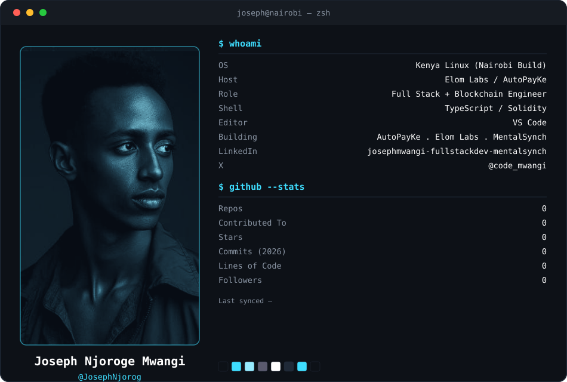

# Profile Card Setup

This adds a live, neofetch-style terminal card (your photo + real GitHub
stats) to the top of `github.com/JosephNjorog/JosephNjorog`, the same
mechanism Andrew6rant's profile uses: a generated SVG, refreshed on a
schedule by a GitHub Action, committed back into the repo.

Everything else already in your README — the `whoami` block, tech stack
badges, GitHub analytics badges, trophies, the **Live Deployed Projects**
table and its own workflow, the contribution snake, etc. — is untouched.
This only replaces the top banner.

## 1. Copy files into your `JosephNjorog/JosephNjorog` repo

```
JosephNjorog/
├── dark_mode.svg
├── light_mode.svg
├── today.py
├── build_svg.py                          (optional — only needed if you
│                                           want to redesign the card later)
├── cache/
│   └── loc_cache.json
└── .github/
    └── workflows/
        └── update-profile-card.yml
```

Your existing `.github/workflows/update-readme.yml` (the one that updates
the Live Deployed Projects table) stays exactly as it is — this is a
second, independent workflow.

## 2. Add the `ACCESS_TOKEN` secret

The default `GITHUB_TOKEN` GitHub Actions gives you can't see full
contribution history or private-repo stats, so:

1. Go to **github.com/settings/tokens** → **Generate new token (classic)**
2. Scopes: `repo` and `read:user`
3. Copy the token
4. In `JosephNjorog/JosephNjorog` → **Settings → Secrets and variables →
   Actions → New repository secret**
   - Name: `ACCESS_TOKEN`
   - Value: the token you copied

## 3. Update your README.md header

Replace the current top banner (the waving-hand image + typing SVG block)
with:

```markdown
<div align="center">

<picture>
  <source media="(prefers-color-scheme: dark)" srcset="dark_mode.svg">
  <source media="(prefers-color-scheme: light)" srcset="light_mode.svg">
  
</picture>

</div>
```

Everything below that (the `⚡ whoami` code block, tech stack, analytics,
live projects table, snake, etc.) stays exactly where it is.

## 4. Run it once

Push the changes, then go to **Actions → Update Profile Card → Run
workflow** to trigger the first run manually — after that it runs daily
at 03:00 UTC. On the first run it will replace the placeholder `0`s with
your real repo count, stars, contributed-to count, commits this year,
net lines of code, and followers, and stamp the "Last synced" date.

## Notes

- The portrait is baked into the SVG as a base64 image, duotoned to match
  your existing `0D1117` / `3EDDFE` badge palette — no external image
  host needed, nothing breaks if you move the repo.
- "Lines of Code" is net additions minus deletions across your owned,
  non-fork repos, pulled from GitHub's `stats/contributors` endpoint and
  cached per-repo by HEAD commit SHA, so repos with no new commits don't
  get re-fetched on every run.
- "Commits (YEAR)" is commits so far in the current calendar year and
  relabels itself automatically each January.
- If you ever want to change the layout, wording, or colors, edit
  `build_svg.py` and re-run it locally (`python3 build_svg.py`) — it
  regenerates both SVGs from scratch using the same embedded portrait.
  `today.py` only ever touches the numbers, never the design.
